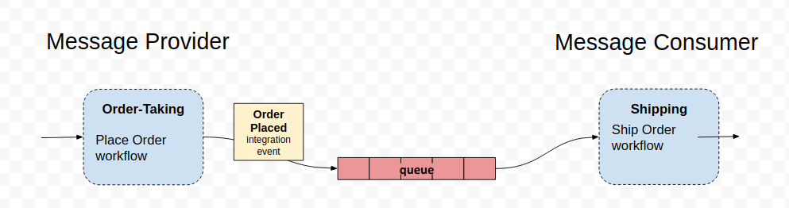

# message-queues-pact-contracts
Demo of PACT Contract Tests for asynchronous communication via message queues.

This sample system is composed of two services:
- Order-taking - allows placing an order via a REST endpoint. On success publishes an Order Placed integration event.
- Shipping - listens for Order Placed events to trigger the Ship order worflow.

in a real use case we could easily have other services listening for the Order Placed event like: billing, business-intelligence, etc.

## References
- Messaging with RabbitMQ
https://spring.io/guides/gs/messaging-rabbitmq/